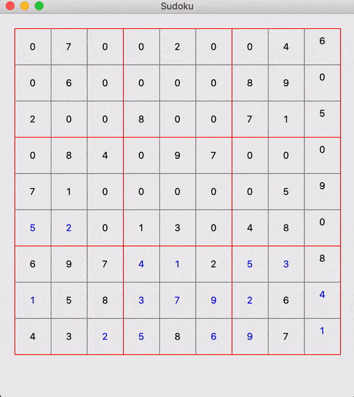

# Sudoku GUI
Shows how the Sudoku algorithm runs. It reads a file that contains the state of the board after each "move". The moves were produced by printing the Sudoku to a file, but the print statements are removed in the final version to avoid slowing down the algorithm.

The animation can speed up or slowed down.

## Assumptions
The file is structured with 9 lines representing each space-separated row of a Sudoku, followed by a blank line. The final matrix in the file is the final solution selected.

## How to run
As this is a GUI, we are not able to run it directly from the Thayer Servers without installing a package, and we don't have sudo apt powers. 

It has been tested on MacOS, and runs well.

We will include a demo in our presentation. But it does work :). Here is a very short gif of it in progress

## References
1. http://newcoder.io/gui/part-3/ for the static UI
